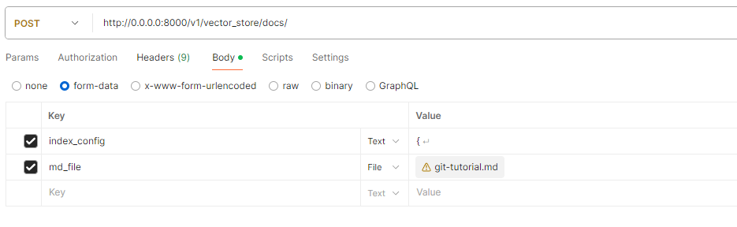
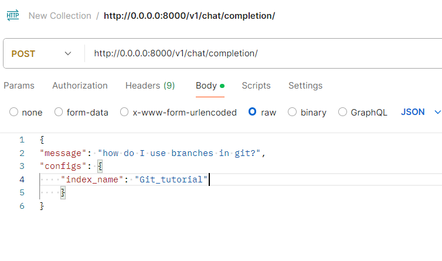
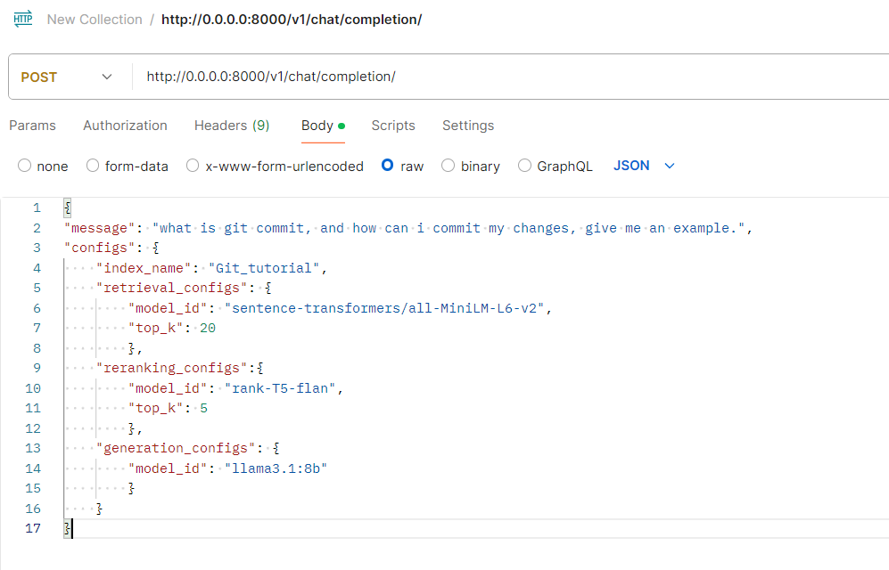

# RAG-based-Knowledge-Extraction

This project provides a RESTful API built using FastAPI to interact with a Retrieval-Augmented Generation (RAG) pipeline.
The API allows users to create a vector store from Markdown files and generate chat responses using an integrated conversational model.

## Prerequisites

* Python = 3.10
* Ollama version 0.1.26 or higher. (https://ollama.com/)

## Setup

1. **Clone the Repository:** Clone this repository to your local machine.
2. **Create a Python virtual environment**: run `python3 -m venv .venv`
3. **Activate the virtual environment**: run source `.venv/bin/activate` on Unix or MacOS, 
or `.\.venv\Scripts\activate` on Windows
4. **Install Dependencies:** run `pip install -r requirements.txt`

## Running the Project
1. Ensure your virtual environment is activated
2. Run the main script with `python main.py`

## Usage
The project offers two primary functionalities:

* Vector Store Creation: Upload Markdown files and automatically 
create a vector store for efficient information retrieval.
* Chat Completion: Generate context-aware chat responses using a 
RAG pipeline that integrates document retrieval with conversational AI.

### Creating a Vector Store from Markdown
To create a vector store from a Markdown file, send a POST request to the `/v1/vector_store/docs/`endpoint with the Markdown file attached.
This saves the vector store locally, and it can be loaded later during generation.


```
POST /v1/vector_store/docs/
```
**Description:** Creates a vector store from an uploaded Markdown file.

**Request:**
`index_config`: JSON configuration for the vector store index.
`md_file`: The Markdown file to process and store.

**Response:**
`index_name`: The name of the created index.
`inserted_count`: Number of documents inserted into the vector store.

**Example in postman:**


**Sample** `index_config`:
```
{
    "index_name": "Git_tutorial",
    "embedding_model_id": "sentence-transformers/all-MiniLM-L6-v2",
    "split_type": "paragraph"
}
```

* `index_name`: represents the name of the index in the vector store
* `embedding_model_id`: Name of the embedding model. You can use any sentence-transformers model from HuggingFace.
https://huggingface.co/models?library=sentence-transformers
* `split_type`:  Method for splitting long documents 
("semantic" for semantic splitting or "paragraph" for paragraph splitting).


#### Chat Completion
To generate a chat response, send a POST request to the /v1/chat/completion/ endpoint with the 
conversation history and configuration details.
```
POST /v1/chat/completion/
```

**Description:** Generates a response for a given message using the RAG pipeline.

**Request:**
`message`: The input message or conversation history.
`configs`: Configuration for retrieval and generation (e.g., models, top_k).

**Response:**
`answer`: The generated chat response.

**Example in Postman**




## RAG Pipeline Explained
The Retrieval-Augmented Generation (RAG) pipeline enhances response generation by integrating document retrieval with conversational AI. The pipeline includes the following steps:
* **Data cleaning:**  Cleans the input Markdown files.
* **Data splitting:** Splits the Markdown content based on header levels. 
If a chunk is too large, it splits further by paragraph or using semantic splitting.

**Pipeline Steps::**
* **Standalone question:** Transforms the user's message into a standalone question.
* **Retrieve Documents:** Retrieves relevant documents based on the question.
* **Rerank and Compress Documents:** The retrieved documents are reranked and the number of relevant documents is decreased. 
* **Input Construction:** Combines the retrieved documents with the original question to generate the final response.

### Models Used in the RAG Pipeline

**1. Retriever Model:**
   - The retriever model is responsible for finding relevant documents based on the user's query.
   - **Important:** These are also the models that can be used to create the embeddings in the vectore store. The model used for retrieval should have the same dimensionality as the model used for creating the vectors in the vector-store.
   - **Supported Models:** You can use any model from the [Hugging Face Model Hub](https://huggingface.co/models) that is compatible with the `sentence-transformers` library.
   - **Example Models:**
     - `sentence-transformers/all-MiniLM-L6-v2`
     - `sentence-transformers/all-MiniLM-L12-v2`
     - `intfloat/multilingual-e5-large`
     - `intfloat/multilingual-e5-base`
     - `sentence-transformers/all-mpnet-base-v2`
     
**2. Reranker Model:**
   - After retrieval, documents are reranked to improve relevance. This step uses models supported by [FlashRank](https://github.com/PrithivirajDamodaran/FlashRank).
   - **Supported Models:** FlashRank supports several reranking models. You can find a list of supported models in the FlashRank documentation.
     - `ms-marco-TinyBERT-L-2-v2`
     - `ms-marco-MiniLM-L-12-v2`
     - `ms-marco-MultiBERT-L-12`
     - `ce-esci-MiniLM-L12-v2`
     - `rank_zephyr_7b_v1_full`
     - `miniReranker_arabic_v1`

**3. Generator Model:**
   - The generator model creates the final response by integrating the retrieved documents with the user’s query.
   - **Supported Models:** Models supported by [Ollama](https://ollama.com/) check the site for the full list.
   - **Example Models:**
     - `llama3.1:8b`, `llama3.1:70b`, `llama3.1:405b`
     - `gemma2:2b`, `gemma2:9b`, `gemma2:27b`
     - `mistral`, `mistral-nemo`, `mistral-large`
     - `mixtral:8x7b`, `mixtral:8x22b` 
     
